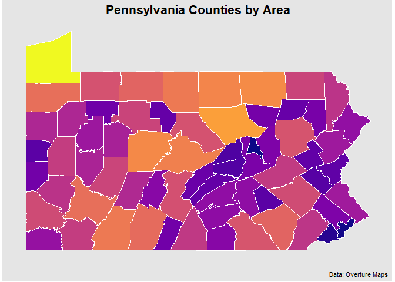

<!-- README.md is generated from README.Rmd. Please edit that file -->

# overtureR <a href="https://arthurgailes.github.io/overtureR/"></a>

<!-- badges: start -->

[](https://lifecycle.r-lib.org/articles/stages.html#experimental)
[](https://CRAN.R-project.org/package=overtureR)
[](https://github.com/arthurgailes/overtureR/actions/workflows/R-CMD-check.yaml)
[](https://app.codecov.io/gh/arthurgailes/overtureR?branch=master)
<!-- badges: end -->

## Installation

``` r
install.packages("overtureR")

# or, dev version
# devtools::install_github("arthurgailes/overtureR")
```

## Usage

Replicating `duckdb` examples fromm the [Overture
docs](https://docs.overturemaps.org/getting-data/duckdb/)

``` r
library(overtureR)
library(dplyr)
library(ggplot2)

counties <- open_curtain("division_area") |>
  # in R, filtering on variables must come before removing them via select
  filter(subtype == "county" & country == "US" & region == "US-PA") |>
  transmute(
    id,
    division_id,
    # STRUCT/MAP columns can be accessed as column[["subcolumn"]] in transmute
    primary = names[["primary"]],
    geometry
  )

# Plot the results
counties |>
  collect() |>
  ggplot() +
  geom_sf(aes(fill = as.numeric(sf::st_area(geometry))))
```



``` r
library(overtureR)
library(dplyr)

# lazily load the full `mountains` dataset
mountains <- open_curtain(type = "*", theme = "places") |>
  transmute(
    id,
    primary_name = names[["primary"]],
    x = bbox[["xmin"]],
    y = bbox[["ymin"]],
    main_category = categories[["primary"]],
    primary_source = sources[[1]][["dataset"]],
    confidence,
    geometry # currently no duckdb spatial implementation
  ) |>
  filter(main_category == "mountain" & confidence > .90)

head(mountains)
#> # Source:   SQL [6 x 8]
#> # Database: DuckDB v1.0.0 [Arthur.Gailes@Windows 10 x64:R 4.2.1/:memory:]
#>   id            primary_name     x     y main_category primary_source confidence
#>   <chr>         <chr>        <dbl> <dbl> <chr>         <chr>               <dbl>
#> 1 08f464e0e312… Kawaikini    -159.  22.1 mountain      meta                0.954
#> 2 08f464e3b1a2… Kalepa       -159.  22.0 mountain      meta                0.938
#> 3 08f464e05984… Sleeping Gi… -159.  22.1 mountain      meta                0.945
#> 4 08f464e3a4d0… Nounou-East… -159.  22.1 mountain      meta                0.945
#> 5 08f464e05514… Makaleha Mo… -159.  22.1 mountain      meta                0.965
#> 6 08f464e03538… Makana       -160.  22.2 mountain      meta                0.938
#> # ℹ 1 more variable: geometry <list>
```

## Roadmap

-   Load all possible views into conn
-   Add beta/alpha datasets
-   Install and load duckdb spatial
-   Allow mirror/local reads via base_url
-   Remove duckdbfs dependency
-   Add mapping vignettes
-   Use pmtiles
-   Remove dbplyr dependencies
-   Add function to write data (stage_write)
-   Add function to preload all types as views
