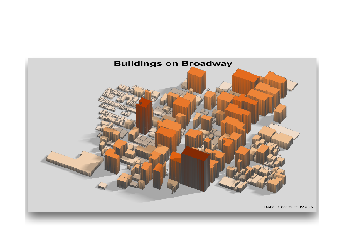

<!-- README.md is generated from README.Rmd. Please edit that file -->

# overtureR <a href="https://arthurgailes.github.io/overtureR/"></a>

<!-- badges: start -->

[](https://lifecycle.r-lib.org/articles/stages.html#stable)
[](https://CRAN.R-project.org/package=overtureR)
[](https://github.com/arthurgailes/overtureR/actions/workflows/R-CMD-check.yaml)
[](https://app.codecov.io/gh/arthurgailes/overtureR?branch=master)
<!-- badges: end -->

## Installation

``` r
install.packages("overtureR")

# devtools::install_github("arthurgailes/overtureR")
```

## Key Features

- Query global [Overture Maps](https://overturemaps.org/) data directly
  in R
- Conduct analysis on massive dataset without loading into memory using
  [dbplyr’s](https://dbplyr.tidyverse.org/) lazy evaluation
- Seamless `dplyr` and `sf` integration
- Merge with your local `sf` data within `duckdb` or with `sf`
- Local downloading for offline use and perforamnce

## Usage

Replicating `duckdb` examples fromm the [Overture
docs](https://docs.overturemaps.org/getting-data/duckdb/)

``` r
library(overtureR)
library(dplyr)
library(ggplot2)

counties <- open_curtain("division_area") |>
  # in R, filtering on variables must come before removing them via select
  filter(subtype == "county" & country == "US" & region == "US-PA") |>
  transmute(
    id,
    division_id,
    primary = names$primary,
    geometry
  ) |>
  collect()

# Plot the results
ggplot(counties) +
  geom_sf(aes(fill = as.numeric(sf::st_area(geometry))), color = "white", size = 0.2) +
  viridis::scale_fill_viridis(option = "plasma", guide = FALSE) +
  labs(
    title = "Pennsylvania Counties by Area",
    caption = "Data: Overture Maps"
  ) 
```


``` r
library(overtureR)
library(dplyr)

# lazily load the full `mountains` dataset
mountains <- open_curtain(type = "*", theme = "places") |>
  transmute(
    id,
    primary_name = names$primary,
    x = bbox$xmin,
    y = bbox$ymin,
    main_category = categories$primary,
    primary_source = sources[[1]]$dataset,
    confidence,
    geometry # currently no duckdb spatial implementation
  ) |>
  filter(main_category == "mountain" & confidence > .90)

head(mountains)
#> # Source:   SQL [6 x 8]
#> # Database: DuckDB v1.0.0 [Arthur.Gailes@Windows 10 x64:R 4.2.1/:memory:]
#>   id            primary_name     x     y main_category primary_source confidence
#>   <chr>         <chr>        <dbl> <dbl> <chr>         <chr>               <dbl>
#> 1 08f464e0e312… Kawaikini    -159.  22.1 mountain      meta                0.954
#> 2 08f464e3b1a2… Kalepa       -159.  22.0 mountain      meta                0.938
#> 3 08f464e05984… Sleeping Gi… -159.  22.1 mountain      meta                0.945
#> 4 08f464e3a4d0… Nounou-East… -159.  22.1 mountain      meta                0.945
#> 5 08f464e05514… Makaleha Mo… -159.  22.1 mountain      meta                0.965
#> 6 08f464e03538… Makana       -160.  22.2 mountain      meta                0.938
#> # ℹ 1 more variable: geometry <POINT [°]>
```

## Downloading data locally

The record_overture function allows you to download Overture Maps data
to a local directory, maintaining the same partition structure as in S3.
This is useful for offline analysis or when you need to work with the
data repeatedly. Here’s an example:

``` r
library(overtureR)
library(ggplot2)
library(dplyr)
library(rayshader)

# Define a bounding box for New York City
broadway <- c(xmin = -73.9901, ymin = 40.755488, xmax = -73.98, ymax = 40.76206)

# Download building data for NYC to a local directory
local_buildings <- open_curtain("building", broadway) |> 
  record_overture(output_dir = tempdir(), overwrite = TRUE)

# The downloaded data is returned as a `dbplyr` object, same as the original (but faster!)
broadway_buildings <- local_buildings |> 
  filter(!is.na(height)) |> 
  mutate(height = round(height)) |> 
  collect() 

p <- ggplot(broadway_buildings) +
  geom_sf(aes(fill = height)) +
  scale_fill_distiller(palette = "Oranges", direction = 1) +
  # guides(fill = FALSE) +
  labs(title = "Buildings on Broadway", caption = "Data: Overture Maps", fill = "")

# Convert to 3D and render
plot_gg(
  p,
  multicore = TRUE,
  width = 6, height = 5, scale = 250,
  windowsize = c(1032, 860),
  zoom = 0.55, 
  phi = 40, theta = 0,
  solid = FALSE,
  offset_edges = TRUE,
  sunangle = 75
)

render_snapshot(clear=TRUE)
```



## Roadmap

- Read pmtiles
- Add partition, chunking to record_overture
- Add beta/alpha datasets
- Add mapping vignette
- Add performance vignette
