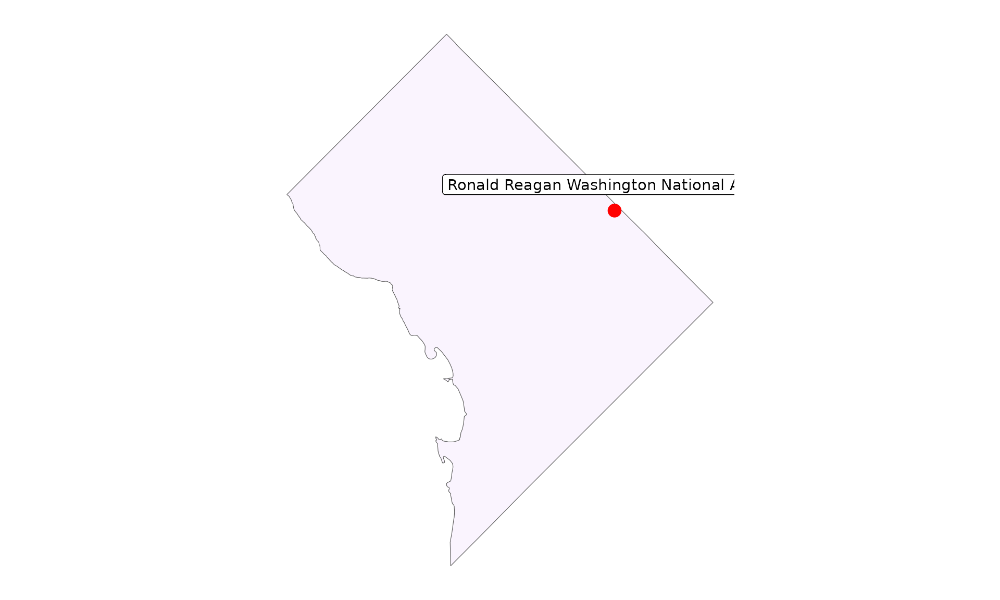
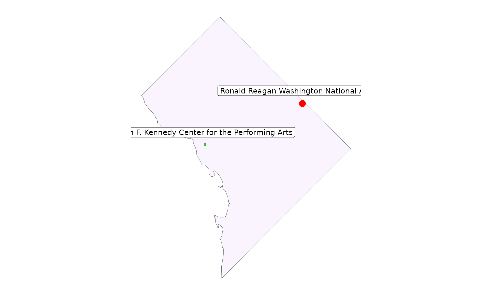
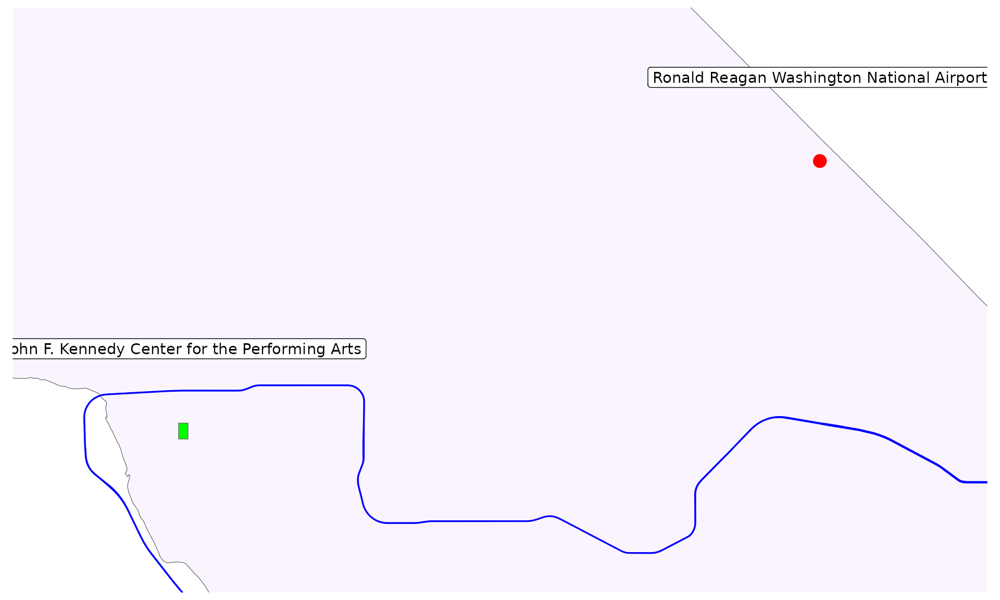

# Raising the Curtain: Getting Started with overtureR

``` r

# install if needed:
install.packages("overtureR")
```

``` r

library(overtureR)
library(ggplot2)
library(dplyr)
library(sf)
```

This vignette demonstrates how to use overtureR to access and visualize
Overture Maps data, focusing on a practical example in Washington, DC:
finding the theater.

Overture Maps is an open-source mapping initiative aimed at developers
who build map services or use geospatial data. It provides a
collaborative, globally-referenced, and quality-assured dataset with a
structured schema. This makes it an excellent resource for creating
reliable and interoperable map products. Using overtureR, we can easily
tap into this rich dataset. In this guide, we’ll walk through the
process of:

1.  Fetching the boundary of Washington, DC
2.  Locating Ronald Reagan National Airport
3.  Finding the Kennedy Center theater
4.  Getting to the Kennedy Center with public transit

[`open_curtain()`](https://arthurgailes.github.io/overtureR/reference/open_curtain.md)
function is our primary tool for accessing Overture Maps data. We’ll
start by using
[`open_curtain()`](https://arthurgailes.github.io/overtureR/reference/open_curtain.md)
to retrieve the DC boundary and pinpoint the airport:

``` r

# Washington, DC boundary
dc <- open_curtain("division_area") |>
  filter(subtype == "region", region == "US-DC") |>
  collect()

# adding a bounding box makes the query faster:
dc_catchment <- st_geometry(dc) |>
  # 10 miles from DC
  st_buffer(10 * 1609.34) |>
  st_bbox()

reagan_airport <- open_curtain("place", spatial_filter = dc_catchment) |>
  filter(
    names$primary == "Ronald Reagan Washington National Airport",
    categories$primary == "airport"
  ) |>
  collect()
#> OGR: Unsupported geometry type

print(reagan_airport)
#> Simple feature collection with 1 feature and 18 fields
#> Geometry type: POINT
#> Dimension:     XY
#> Bounding box:  xmin: -76.95801 ymin: 38.92816 xmax: -76.95801 ymax: 38.92816
#> Geodetic CRS:  WGS 84
#> # A tibble: 1 × 19
#>   id                 geometry categories$primary confidence websites emails
#> * <chr>           <POINT [°]> <chr>                   <dbl> <list>   <list>
#> 1 61187… (-76.95801 38.92816) airport                 0.972 <NULL>   <NULL>
#> # ℹ 14 more variables: categories$alternate <list>, socials <list>,
#> #   phones <list>, brand <df[,2]>, addresses <list>, names <df[,3]>,
#> #   sources <list>, operating_status <chr>, basic_category <chr>,
#> #   taxonomy <df[,3]>, version <int>, bbox <df[,4]>, theme <chr>, type <chr>
```

By default, `open_curtain` would search through every “place” (aka point
of interest) in the world - an enormous dataset. Obviously, that’s too
much to load into most computers’ memory, so `open_curtain` does this
lazily. Only after calling `collect_sf` does it load data onto your
computer. So we filter the data first, spatially and by name, like so:

1.  fetch the boundary of Washington, DC from the “division_area”
    dataset;
2.  filter for the specific region we wanted;
3.  create a spatial buffer around DC to define our area of interest for
    subsequent queries; and
4.  locate Ronald Reagan National Airport using the “place” dataset,
    filtering by name and category.

Afterwards, `collect_sf` brings the only the data need into memory. For
more on lazy programming, see the [dbplyr
documentation](https://dbplyr.tidyverse.org/).

Now that we’ve set the stage with our starting point, let’s spotlight
our destination. In the next code block, we’ll locate the Kennedy
Center:

``` r

reagan_plot <- ggplot() +
  geom_sf(data = dc, fill = "purple", alpha = 0.05) +
  geom_sf(data = reagan_airport, color = "red", size = 4) +
  geom_sf_label(
    data = reagan_airport, nudge_y = 0.01, aes(label = names$primary)
  ) +
  theme_minimal() +
  theme(
    axis.title = element_blank(),
    axis.text = element_blank(),
    axis.ticks = element_blank(),
    panel.grid = element_blank()
  )

reagan_plot
```



In this code, we’ve queried the “building” dataset within our defined DC
area. We used a text filter to find buildings with “The Kennedy Center”
in their name. This demonstrates overtureR’s ability to perform
text-based searches within the Overture Maps dataset.

To get to the theater, we’ll need to know our transit options. The
following code showcases overtureR’s capacity to handle more complex
spatial and attribute queries:

``` r


kennedy_center <- open_curtain("building", st_bbox(dc)) |>
  filter(grepl("Kennedy Center", names$primary)) |>
  collect()


kennedy_plot <- reagan_plot +
  geom_sf(data = kennedy_center, fill = "green") +
  geom_sf_label(data = kennedy_center, nudge_y = 0.01, aes(label = names$primary))
kennedy_plot
```



In the code above, we’ve created a bounding box that encompasses both
the airport and the Kennedy Center, plus a one-mile buffer. We then used
this to filter the “segment” dataset for rail transit, specifically the
Blue Line of the DC Metro.

For the grand finale, we’ll create a map that displays all the elements
we’ve gathered:

``` r

# filter town to areas that are within ~1 mile of our two points
kennedy_reagan_bbox <- bind_rows(kennedy_center, reagan_airport) |>
  st_bbox() |>
  st_as_sfc() |>
  st_buffer(1 * 1609.34) |>
  st_bbox()

dc_transit <- open_curtain("segment", kennedy_reagan_bbox) |>
  filter(
    subtype == "rail",
    # filter to the Blue Line of the DC Metro
    grepl("Metro", names$primary),
    grepl("Blue", names$primary)
  ) |>
  select(id, names, geometry) |>
  collect()

print(dc_transit)
#> Simple feature collection with 16 features and 2 fields
#> Geometry type: LINESTRING
#> Dimension:     XY
#> Bounding box:  xmin: -77.07099 ymin: 38.87016 xmax: -76.89703 ymax: 38.90138
#> Geodetic CRS:  WGS 84
#> # A tibble: 16 × 3
#>    id                                   names$primary                   geometry
#>  * <chr>                                <chr>                   <LINESTRING [°]>
#>  1 19851ca0-83f2-4e75-9bfd-62b2db763176 Washington Me… (-77.05259 38.87016, -77…
#>  2 29d8560d-34fe-47f5-8b2c-c5c276158888 Washington Me… (-77.06368 38.88548, -77…
#>  3 f3be69a6-4842-4960-876d-974f53fd1b0a Washington Me… (-77.07089 38.89466, -77…
#>  4 2f677d3b-22eb-4da0-9190-006a8ba0f170 Washington Me… (-77.06389 38.88592, -77…
#>  5 5905e0a3-5de7-4bc7-b03e-c9e4575beb18 Washington Me… (-77.06363 38.8855, -77.…
#>  6 1992200a-1872-471b-ae55-7063c6922625 Washington Me… (-77.06394 38.8859, -77.…
#>  7 ea9a4d22-30fa-4643-b073-3079c178bd53 Washington Me… (-77.06174 38.88253, -77…
#>  8 991babf5-2254-41c0-815f-249582189435 Washington Me… (-77.06174 38.88253, -77…
#>  9 516b8b21-6fe1-4836-94ed-daed052376e6 Washington Me… (-76.96203 38.8974, -76.…
#> 10 22be2fe4-155b-4fc6-8ea7-bb40ee6e9def Washington Me… (-77.07085 38.89466, -77…
#> 11 766a668b-0b87-46af-a517-049af37f468e Washington Me… (-76.95847 38.89692, -76…
#> 12 948a1b5e-5a65-4d66-b4bd-c9fc0a9b9967 Washington Me… (-76.96205 38.89731, -76…
#> 13 4c24e61d-0d1f-4ceb-8e55-bdf7deb1bff6 Washington Me… (-76.95801 38.89686, -76…
#> 14 3d279ff2-a480-40b1-a40c-607cd10bd293 Washington Me… (-76.95849 38.89684, -76…
#> 15 da53a8d2-4a96-4051-8d57-34ce0430a657 Washington Me… (-76.89703 38.88678, -76…
#> 16 01ae58ce-08a2-4c71-a2c7-c8338c85e1f9 Washington Me… (-76.95803 38.89678, -76…
#> # ℹ 2 more variables: names$common <list>, $rules <list>
```

This final step uses ggplot2 to create a map that displays the airport,
the Kennedy Center, and the Metro Blue Line connecting them. This
visualizes the route from our arrival point to our theatrical
destination.

``` r

kennedy_plot +
  geom_sf(data = dc_transit, color = "blue") +
  coord_sf(
    xlim = c(kennedy_reagan_bbox[["xmin"]], kennedy_reagan_bbox[["xmax"]]),
    ylim = c(kennedy_reagan_bbox[["ymin"]], kennedy_reagan_bbox[["ymax"]]),
  )
```



Perfect, it looks like we can take the blue line straight there. Break a
leg!
